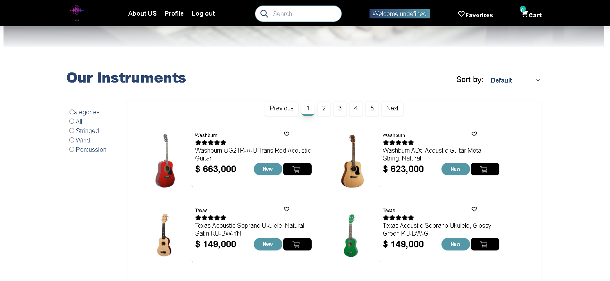

### <h1>Hola, Soy Oscar Restrepo</h1>

Soy un Desarrollador Backend, con una pasión por liderar el desarrollo de tecnologías robustas para aplicaciones críticas. Mi enfoque se centra en la toma de decisiones estratégicas y el diseño de arquitecturas tecnológicas sólidas, seguras y escalables. Destaco por mi capacidad para liderar equipos y proyectos hacia el éxito tecnológico. 

<h2 align="left">🛠️ Tecnologias:</h2>

<h4>BackEnd & DataBase</h4>

 
 

 
 

<h4>FrontEnd</4>

 

 

 

<h2 align="left">🚀 Mis Proyectos:</h2>

<h3>MusiCommerce</h3>
 
 <a href="https://musicommerce2022.vercel.app/">Ingresa a MusiCommerce</a>

MusiCommerce es un e-commerce especializado en la venta y distribución de instrumentos musicales. Nuestro principal objetivo es crear una plataforma para ofrecer una variedad de productos de calidad (nuevos y usados) a nuestros clientes y que puedan ser adquiridos de manera rápida y segura.

Este proyecto lo hemos realizado pensando en dos perfiles. Por una parte está el usuario o comprador y por el otro el administrador o administradores de

Las características del proyecto son las siguientes:

<b>Usuarios</b>

<ul>
<li>Registrarse , iniciar sesión</li>
​<li>​Buscar instrumentos por nombre</li>
<li>​Filtrar por categorías</li>
<li>​​Ordenar por precio y alfabéticamente</li>
<li>Pasarela de pago</li>
<li>Carrito de compras y página de favoritos</li>
<li>Editar su perfil</li>
<li>Botón whatsApp</li>
 <li>Mailing para </li>
</ul>

<b>Administradores</b>

<ul>
<li>Módulo Instrumentos</li>
<li>Módulo Usuarios</li>
<li>Módulo Administradores</li>
<li>Módulo Historyshop con estadísticas de productos vendidos</li>
<li>Módulo Categorías</li>
</ul>

En cada módulo se puede crear, editar, eliminar y buscar elementos

Tecnologías
#javascript
#react
#redux
#html5
#tailwindcss
#nodejs
#tailwindcss
#express
#sequelize
#postgreSQL

<h2 align="left">Conecta conmigo</h2>

<h2 align="left">Contáctame</h2>

 oscar.restrepo2@gmail.com

